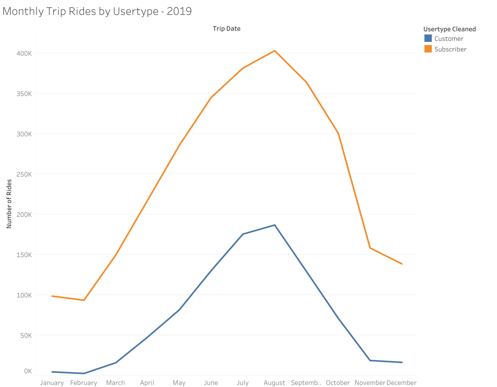
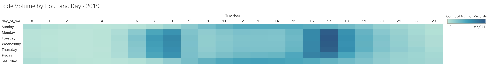

# ride-sharing-capstone
Portfolio project analyzing 2019 ride-sharing usage with SQL and Tableau

# 🚲 Ride-Sharing Capstone Project – 2019

This project analyzes a full year of ride-sharing data (2019) to explore usage patterns by month, user type, time of day, and gender.

## 🔧 Tools Used
- **BigQuery**: SQL-based data cleaning and feature extraction
- **Tableau Public**: Visualization and dashboard
- **R Markdown**: Project write-up and documentation

## 📈 Key Insights
- **Subscribers** ride more often, but **Customers** take longer rides.
- Ride volume peaks in summer and during weekday rush hours.
- Most rides occur between 7–9 AM on weekdays.
- Gender/user type distributions show actionable user segments.

## 📄 Files Included
- [`ride_sharing_capstone_2019.Rmd`](https://github.com/pooja-9nov/ride-sharing-capstone/blob/main/ride_sharing_capstone_2019.Rmd)
- [`monthly_rides.png`]
- ['avg_duration.png]
- ['heatmap.png]
- [usertype_split.png]
- [`ride_data.csv`](https://github.com/pooja-9nov/ride-sharing-capstone/blob/main/ride-data)

## 🌐 Tableau Dashboard
[🔗 View it on Tableau Public](https://public.tableau.com/app/profile/pooja.kapoor3698)

## 📸 Dashboard Previews

### Monthly Ride Trends

### Peak Usage Heatmap

---
**Author:** Pooja Kapoor
